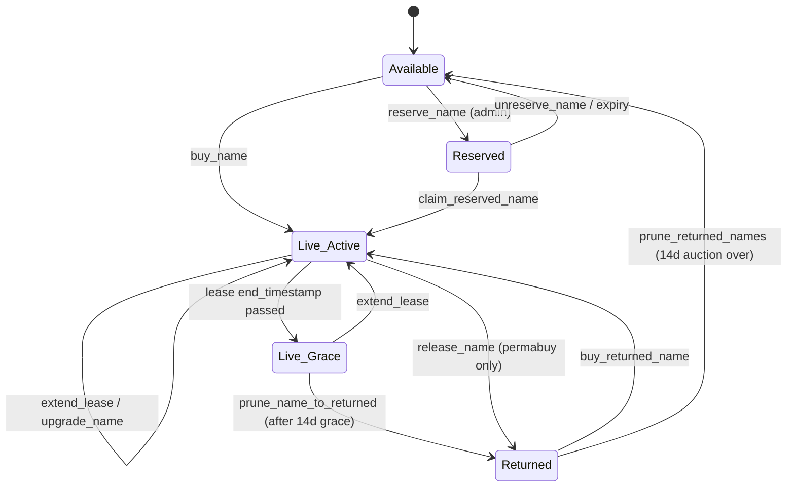

# AR.IO Name System Specifications (ArNSS)

## Status:

**Draft**

## Version:

| Version | Description                                                         | Date       |
| ------- | ------------------------------------------------------------------- | ---------- |
| 1.0.0   | Initial version of the Arweave Name System Specifications overview. | 2024-09-01 |
| 1.0.1   | Updated reference implementation links                              | 2024-09-24 |
| 1.0.2   | Added priority field for undernames and AR.IO Network integration.  | 2025-07-29 |
| 1.0.3   | Added undername ownership and delegated control features.           | 2025-08-01 |
| 2.0.0   | Rebrand to AR.IO Name System, Solana migration, multi-protocol resolution. | 2026-04-20 |
| 2.1.0   | Audit corrections: `NameRegistry` slot count, registry-side scope statement, pluggable ANT program note. | 2026-05-11 |
| 2.2.0   | Added Name Validation, Name Lifecycle, Primary Names concept; Architecture diagram, Program IDs lookup, Account Serialization, Events sections. | 2026-05-11 |
| 2.2.1   | Contract-drift corrections: `NameRegistry` initial capacity is 50,000 (expandable, not 200,000); event ABI policy is ADR-018; whitepaper link moved off arweave.net; "previously the Arweave Name System" note. | 2026-06-09 |

## Abstract

These specifications outline the overview, structure, and operations of the AR.IO Name System. They define the creation and management of AR.IO Name Tokens (ANTs), which are Metaplex Core NFTs on Solana used within the AR.IO Name System (ArNS) to resolve human-readable names to content stored on decentralized storage networks. By defining both the standard and optional interfaces for these tokens and the programs that manage them, this document aims to ensure consistency and interoperability for developers integrating ANTs into their own applications.

## Motivation

The building blocks in the AR.IO Name Specifications ensure that ArNS can serve a broad spectrum of use cases, from simple name resolution to complex, multi-layered digital services. This could include custom resolution logic or interfaces suited to particular user groups or technical requirements. Developers can utilize the open protocols and APIs in these specifications to create resolvers and name management tooling tailored to specific applications or networks.

For instance, a resolver could be built to integrate with decentralized applications on other blockchain platforms, to support enhanced security features like cryptographic validation of name queries, or to resolve content across multiple storage protocols.

By extending the utility of ArNS across different technologies and storage networks, developers can further enhance its overall interoperability and flexibility.

## AR.IO Name System

### Motivation

Arweave Transaction IDs, IPFS Content Identifiers (CIDs), and Solana addresses, characterized by their length and complexity, present usability challenges for everyday applications. They are cumbersome to remember, share, and are often erroneously flagged as spam by filters.

The AR.IO Name System (ArNS — previously the Arweave Name System; the acronym is retained) addresses these issues by introducing a decentralized, censorship-resistant naming system built on the Solana blockchain. ArNS allows for the assignment of human-readable names to content stored on decentralized storage networks, starting with Arweave and extending to IPFS and future protocols. Names can point to dApps, web pages, files, digital identities, or any content addressable by a supported storage protocol.

Using ARIO tokens (SPL tokens on Solana) for transactions and compatible with AR.IO gateway domains, ArNS simplifies access to permaweb content, making it more navigable and user-friendly. It serves as a practical tool for enhancing user interactions on the network by replacing opaque identifiers with memorable names, thereby streamlining access and communication across the decentralized web.

### Overview

The ArNS system functions similarly to traditional DNS services, where users can purchase a name in a registry and DNS name servers resolve these names to IP addresses.

- **Permanent and Lease-Based Name Registration**: Users can purchase names permanently or lease them for a defined period, depending on their needs. The registry is stored on-chain via the `ario-arns` Solana program, making it immutable and globally resilient.
- **Wayback Machine for Data**: The on-chain history enables applications and infrastructure to not only read the latest state of the registry but also audit any point in time in the past via Solana's ledger history, creating a "Wayback Machine" of the permaweb.

- **Name Registration Process**: Users can register a name, like `ardrive`, within the ArNS Registry. Before owning a name, they must create an AR.IO Name Token (ANT) -- a Metaplex Core NFT on Solana used by ArNS to track ownership and control over the name. ANTs allow the owner to set a mutable pointer to any type of permaweb data, such as a page, dApp, or file, via a content target. The target can be an Arweave Transaction ID, an IPFS CID, or an identifier for any future supported storage protocol.

- **Multi-Protocol Content Resolution**: Each ANT record includes a `target` field (the content address) and a `targetProtocol` field that declares which storage protocol the target belongs to (`0` = Arweave, `1` = IPFS, with additional protocols addable via program upgrades). This enables a single ArNS name to serve content from different storage networks across its undernames. For example, the root record of `ardrive` could point to an Arweave Transaction ID while its `blog` undername points to an IPFS CID.

- **ArNS Resolvers**: Each AR.IO gateway acts as an ArNS name resolver. Gateways read the latest state of both the ArNS Registry and its associated ANTs from the Solana blockchain and serve this information rapidly for applications and users. AR.IO gateways resolve names as subdomains of their gateway domain, e.g., `https://ardrive.ar.io`, and proxy requests to the associated content target on the appropriate storage network. This ensures ANTs work across all AR.IO gateways or ArNS Resolvers that support them: `https://ardrive.g8way.io/`, `https://ardrive.ar.io`, etc.

- **Protocol-Agnostic URL Schemes**: The `ar://` prefix means "resolve via AR.IO gateway" and is protocol-agnostic -- the gateway determines the storage protocol from the ANT record's `targetProtocol` field. For example, `ar://ardrive` resolves through an AR.IO gateway regardless of whether the underlying content is on Arweave or IPFS. The `ipfs://` prefix is reserved for IPFS-specific resolution.

- **User Accessibility**: Users can easily reference these friendly names in their browsers, and other applications and infrastructure can build rich solutions on top of these ArNS primitives.

### AR.IO Name System Registry

The ArNS Registry is a list of all registered names and their associated AR.IO Name Token mint addresses. The registry is managed by the `ario-arns` Solana program and supports on-chain enumeration via the `NameRegistry` zero-copy account (50,000 name slots at initial deploy; expandable post-deploy via `admin_expand_name_registry`). There are two different types of name registrations that can be utilized based on the needs of the user:

- **Lease**: A name may be leased on a yearly basis. A leased name can have its lease extended or renewed, but only up to a maximum active lease of 5 years at any time.
- **Permanent (Permabuy)**: A name may be purchased for an indefinite duration.

Registering a name requires spending ARIO tokens corresponding to the name's character length and purchase type. Key registry rules embedded within the on-chain program include:

- **Genesis Prices**: Set within the program as starting conditions.
- **Dynamic Pricing**: Varies based on name length, purchase type (lease vs. buy), lease duration, and current Demand Factor.
- **Name Records**: Include a pointer to the AR.IO Name Token mint address, lease end time (`None` for permabuy, `Some(timestamp)` for lease), and undername allocation.
- **Reassignment**: The current name owner (the `ArnsRecord.owner`, set at purchase) can reassign the name to a different AR.IO Name Token.
- **Lease Extension**: Permissionless -- any ARIO holder can pay to extend an active lease, up to 5 years remaining at any time.
- **Lease to Permanent Buy**: Permissionless -- any ARIO holder can pay the upgrade fee to convert an active lease to a permanent buy.
- **Undername Capacity**: Permissionless -- any ARIO holder can pay to add undername capacity to an active name.
- **Name Removal**: Name records can only be removed from the registry if a lease expires, or a permanent name is returned to the protocol by its owner via `release_name`.

#### Name Validation

ArNS names are validated on-chain at purchase:

- 1 to 51 characters (inclusive).
- Lowercase ASCII only: `[a-z0-9-]`.
- Must start and end with an alphanumeric character (no leading/trailing hyphen).
- A single character must be alphanumeric (no single-hyphen name).
- **Names of exactly 43 characters are prohibited** — every Arweave address is 43 base64url characters, so disallowing this length prevents an ArNS name from colliding with the gateway's CID/TX-ID URL space.

### AR.IO Name Tokens (ANTs)

AR.IO Name Tokens (ANTs) are Metaplex Core NFTs on Solana that manage the ownership, configuration, and content pointer records for names registered in ArNS. They facilitate the mapping of names to content on decentralized storage networks -- whether a webpage, dApp, or file -- through content targets and their associated storage protocols. ANTs are true NFTs and can be transferred as needed using standard Solana NFT tooling.

- **Token Ownership**: Each registered ArNS name points to the mint address of an ANT. The holder of this NFT controls how the ArNS name functions. ANT holders can manage records, add controllers, and update metadata. The NFT can be transferred to a new Solana wallet, which automatically grants the new holder full control (with lazy controller cleanup on transfer).
- **Pluggable ANT Program**: Each ANT may declare a custom backing program via the `ANT Program` entry in its Metaplex Core Attributes plugin. Resolvers route PDA derivation through that program, falling back to the canonical `ARIO_ANT_PROGRAM_ID` when the trait is absent. This enables third-party ANT implementations without changing the registry side. See [ARNS-CORE-1 §Implementation Note](arns-core-1.md#implementation-note).
- **On-Chain Configuration**: Each ANT has associated on-chain accounts managed by the `ario-ant` Solana program: an `AntConfig` (metadata, display name, ticker, logo, description, keywords), an `AntControllers` list (up to 10 delegated controller addresses), and `AntRecord` accounts for each undername (content target, target protocol, TTL, priority, and optional per-record metadata).
- **Resolution**: AR.IO Gateways and other ArNS Resolvers read the state from these registered ANTs on Solana to properly resolve and serve the data they reference. The gateway inspects the `targetProtocol` field to determine which storage network to fetch content from.
- **AR.IO Network Integration**: ANT owners can interact directly with the AR.IO network programs on Solana, enabling them to release names back to the registry, reassign names to other ANTs, and manage primary name associations.

### Undernames

Undernames allow AR.IO Name owners to create multiple subdomains for a registered ArNS name, providing flexibility and extended functionality.

- **Naming Conventions**: These are configured using underscores (`_`) instead of dots (`.`), emphasizing the hierarchical relationship directly controlled by the primary name owner -- ensuring that `dapp_ardrive` is unmistakably tied to `ardrive`. Unlike traditional DNS, names resembling undernames cannot be registered independently within ArNS, avoiding potential confusion and spoofing.
- **Priority Sorting**: Undernames can be assigned priority values to determine their sort order when served by gateways, helping owners organize and prioritize their subdomains effectively.
- **Delegated Ownership**: ANT owners can delegate control of specific undernames to other users through record-level ownership (the optional `owner` field on `AntRecord`). Record owners can manage their undername's `target`, `ttl_seconds`, and metadata, but cannot change `priority` or reassign ownership. The ANT NFT holder retains ultimate authority. This enables use cases like community management, marketplaces, and distributed collaboration.
- **Mixed Protocols**: Each undername can independently target a different storage protocol. For example, the `@` (root) record could point to an Arweave Transaction ID while a `docs` undername points to an IPFS CID. The `targetProtocol` field on each record determines the storage network for that undername.

### Primary Names

A **primary name** is a wallet's display identity within the AR.IO ecosystem. When wallet `W` sets `ardrive_alice` as its primary, gateways and apps can render `W` as that name. Primary names are a two-way binding (forward: wallet → name; reverse: name → wallet) and require consent from both the requesting wallet and the name owner. The binding can be dissolved at any time by either party. Primary names are managed by the `ario-core` program; see [ARNS-MANAGE-1 §Primary Names](arns-manage-1.md#primary-names) for the full flow and instruction surface.

### Name Lifecycle

A name occupies exactly one state at a time. Transitions are driven by specific instructions or by time-based events at the next on-chain interaction.



- **Available** — no `ArnsRecord` PDA exists for the name; anyone may register via `buy_name`.
- **Reserved** — a `ReservedName` PDA exists (admin-set via `reserve_name`). Blocks open registration; may be claimed by a designated target wallet via `claim_reserved_name`, or released by `unreserve_name` / expiry.
- **Live (Active)** — `ArnsRecord` exists and `(purchase_type == Permabuy) || (end_timestamp > now)`. The resolver serves the name.
- **Live (Grace)** — `ArnsRecord` exists; lease has expired but `now < end_timestamp + 14 days`. The name is still resolvable (so users don't see immediate downtime); the owner may still `extend_lease`, but `reassign_name` is blocked.
- **Returned** — `ReturnedName` PDA exists (lease past grace, or permabuy released). A 14-day decaying auction runs: price starts at `RETURNED_NAME_MAX_MULTIPLIER` (50×) of the base fee and decays linearly to 1× over the 14 days. After the auction, the name returns to Available via `prune_returned_names`.

Key constants (`ario-arns`): `GRACE_PERIOD_SECONDS = 14d`, `RETURNED_NAME_DURATION_SECONDS = 14d`, `RETURNED_NAME_MAX_MULTIPLIER = 50`, `MAX_LEASE_LENGTH_YEARS = 5`.

### Name Resolution

The AR.IO Name System is designed so that registered names can be accessed across many top-level domain names, providing resiliency and censorship resistance.

- **Access**: Names registered on ArNS are accessed through standardized URLs formatted as subdomains of an ArNS Resolver, such as `https://ardrive.ar.io`.
- **Resolver Functionality**: ArNS Resolvers read the latest state of the ArNS Registry and associated ANTs directly from the Solana blockchain, so they can serve the most up-to-date content pointers found for a registered name. The resolver inspects the `targetProtocol` field to route content retrieval to the correct storage network.
- **Gateway Integration**: AR.IO Gateways come with an ArNS Resolver out of the box, ensuring that ArNS names are consistently resolvable across any supporting gateway, extending their accessibility throughout the decentralized web. Additionally, gateways are incentivized to resolve registered ArNS names into actionable content URLs via the AR.IO Observation and Incentive Protocol.
- **On-Chain Enumeration**: The `NameRegistry` zero-copy account in the `ario-arns` program enables permissionless enumeration of all registered names directly from the Solana blockchain, without requiring an external indexer.

## Specification Framework

The AR.IO Name System Specifications span across several specs that can be composed to make custom resolvers, AR.IO Name Token implementations, or custom variations of them.

- **ARNS-TOKEN-1**: Specifies the creation and structure of AR.IO Name Tokens as Metaplex Core NFTs, focusing on token functionality and metadata.
- **ARNS-MANAGE-1**: Details the management and control features for AR.IO Names, including registry operations and ANT record management.
- **ARNS-CORE-1**: The foundational on-chain program specification for ArNS name resolution, detailing the core requirements for resolvers.
- **ARNS-RESOLVER-1**: Outlines the protocols for resolving and serving AR.IO Names across the AR.IO network, including the `ar://` and `ipfs://` URI schemes, multi-protocol content retrieval, and routing semantics. The `ar://` prefix is protocol-agnostic -- the target storage protocol is determined by the ANT record's `targetProtocol` field.

Applications like `https://arns.ar.io` can leverage this framework via SDKs like the AR.IO SDK or extend them further to create a rich ecosystem of tooling that supports the needs of ArNS name buying, management, and resolution.

### Reference Implementation

The specifications are designed to be implementation-agnostic. The reference implementation is built on Solana using Rust and the Anchor framework. Developers are not restricted to Rust or Solana when building custom resolvers or extending ArNS functionality, provided they adhere to the protocols and specifications outlined in these documents.

The core Solana programs that comprise the AR.IO network on-chain infrastructure are:

- **ario-core** -- ARIO SPL Token (mint/transfer), user vaults (time-locked tokens), primary name resolution
- **ario-gar** -- Gateway Address Registry, operator/delegate staking, epoch lifecycle, observation and incentive protocol
- **ario-arns** -- ArNS name registry (buy/lease/permabuy), demand factor pricing, reserved/returned names, lease management
- **ario-ant** -- AR.IO Name Token as Metaplex Core NFT, undername records, controller management

> **Scope.** These specifications cover the ArNS interoperability surface: records, ANT management, and name resolution. Registry-side instructions on `ario-arns` (name purchase, lease management, reservations, demand-factor maintenance, pruning, and fund-from-stakes variants) are part of the protocol but are documented by the `ario-arns` IDL and the AR.IO SDK rather than these specs. The `ario-ant-escrow` program (trustless ANT/token escrow used during migration and for non-custodial custody) is also out of scope here.

#### Architecture

```mermaid
flowchart LR
    subgraph ario-arns
        NR[NameRegistry<br/>zero-copy, 50k slots (initial)]
        AR[ArnsRecord<br/>per-name PDA]
        RV[ReturnedName / ReservedName<br/>lifecycle PDAs]
    end

    subgraph ario-ant
        AC[AntConfig]
        ACT[AntControllers]
        REC[AntRecord<br/>per-undername]
        META[AntRecordMetadata<br/>optional]
    end

    subgraph ario-core
        PN[PrimaryName / PrimaryNameReverse]
        VLT[Vaults, ARIO SPL]
    end

    Wallet[User Wallet] -->|holds| NFT[ANT NFT<br/>Metaplex Core Asset]
    NFT -.->|companion PDAs| AC
    NFT -.-> ACT
    NFT -.-> REC
    REC -.-> META
    AR -->|ant pubkey| NFT
    NR -->|enumerates| AR
    Resolver[Resolver / Gateway] -->|reads| AR
    Resolver -->|reads| NFT
    Resolver -->|reads| REC
    Resolver -->|reads| META
```

The asset's Metaplex Core Attributes plugin carries an `ANT Program` entry naming the program that owns its `AntConfig` / `AntControllers` / `AntRecord` / `AntRecordMetadata` PDAs. Resolvers route accordingly (see [ARNS-CORE-1 §Implementation Note](arns-core-1.md#implementation-note)).

#### Program IDs

These specifications do not pin program IDs in line — addresses move during deployment phases (devnet → testnet → mainnet). Implementations MUST source the current IDs from one of:

- The published Anchor IDL for each program (`ario_core.json`, `ario_gar.json`, `ario_arns.json`, `ario_ant.json`). The `address` field in each IDL is authoritative.
- The AR.IO SDK's exported constants (`@ar.io/sdk` → `ARIO_CORE_PROGRAM_ID`, `ARIO_ARNS_PROGRAM_ID`, `ARIO_ANT_PROGRAM_ID`, `ARIO_GAR_PROGRAM_ID`), which mirror the IDLs.
- The `ANT Program` Attributes-plugin entry on a specific asset (per-asset BYO-ANT routing; see ARNS-CORE-1 §Implementation Note).

The Metaplex Core program ID is the upstream standard and is stable: `CoREENxT6tW1HoK8ypY1SxRMZTcVPm7R94rH4PZNhX7d`.

#### Account Serialization

All AR.IO program accounts follow Anchor's conventions:

1. **Discriminator** — every program account begins with an 8-byte discriminator equal to the first 8 bytes of `sha256("account:<StructName>")` (e.g., `sha256("account:AntConfig")[..8]`). Readers MUST verify the discriminator before interpreting account data.
2. **Body** — the remainder is [Borsh-serialized](https://borsh.io/) per the struct definition published in the program's IDL. `Option<T>` is encoded as 1-byte tag (`0` = None, `1` = Some) followed by the encoded `T` when present. `Vec<T>` and `String` are length-prefixed (4-byte little-endian u32 length).
3. **Event records** — events appear in transaction logs as `Program data: <base64>` lines. The decoded blob is `[discriminator(8) || borsh_payload]` where the discriminator is `sha256("event:<EventName>")[..8]`. See `#### Events` below.
4. **Metaplex Core assets** — the ANT mint account follows the upstream AssetV1 layout (not Anchor-discriminated). Byte 0 is the Metaplex Core Key discriminator; bytes 1-32 are the current owner pubkey. Plugin chain follows; the `ANT Program` Attribute lives in the Attributes plugin entry.

#### Events

Every state-changing instruction on `ario-core`, `ario-gar`, `ario-arns`, and `ario-ant` emits an Anchor `#[event]` record via `emit!()` (Solana's `sol_log_data` syscall). Events are the recommended way for indexers, dApps, and resolvers to receive push-based updates without diffing account state.

- Wire format: `Program data: <base64>` log line; decoded blob = `[discriminator(8) || borsh_payload]`.
- Subscription: standard Solana `logsSubscribe` against the relevant program ID, or one-shot decoding of a confirmed transaction's `logMessages`.
- Canonical decoder: the AR.IO SDK exposes `parseTransactionEvents(rpc, sig)` and `parseEventsFromLogs(logs)` (`@ar.io/sdk/solana`).
- The full event surface (74+ events at time of writing) and per-event payload schemas are published with each program's IDL and in the AR.IO repo's `docs/EVENTS.md`. These specifications do not enumerate individual events because the event set evolves additively post-mainnet under the ABI policy of ADR-018.

### Implementations

The following implementations serve as references for building ArNS-compatible resolvers, name tokens, and management tooling.

- ARNS-RESOLVER-1: AR.IO Gateways (ar-io-node) -- TypeScript, Node.js, Docker
- ARNS-CORE-1: `ario-ant` Solana program -- Rust, Anchor
- ARNS-MANAGE-1: `ario-ant` + `ario-arns` Solana programs -- Rust, Anchor
- ARNS-TOKEN-1: Metaplex Core NFT on Solana
- AR.IO SDK: https://github.com/ar-io/ar-io-sdk -- TypeScript (supports both Solana and legacy AO backends)

## References

- AR.IO White Paper https://html_whitepaper.ar.io/
- Metaplex Core NFT Standard https://developers.metaplex.com/core
- Solana Program Library (SPL) Token https://spl.solana.com/token
- AR.IO SDK https://github.com/ar-io/ar-io-sdk
